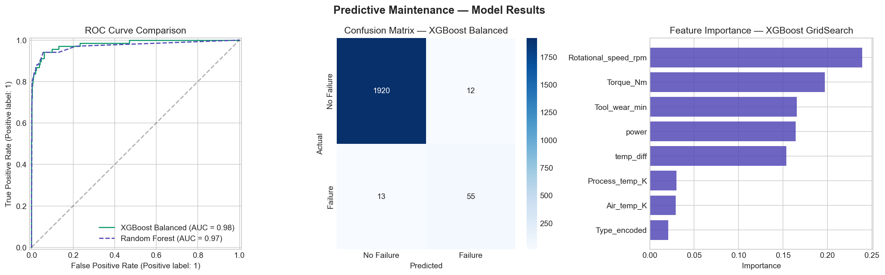
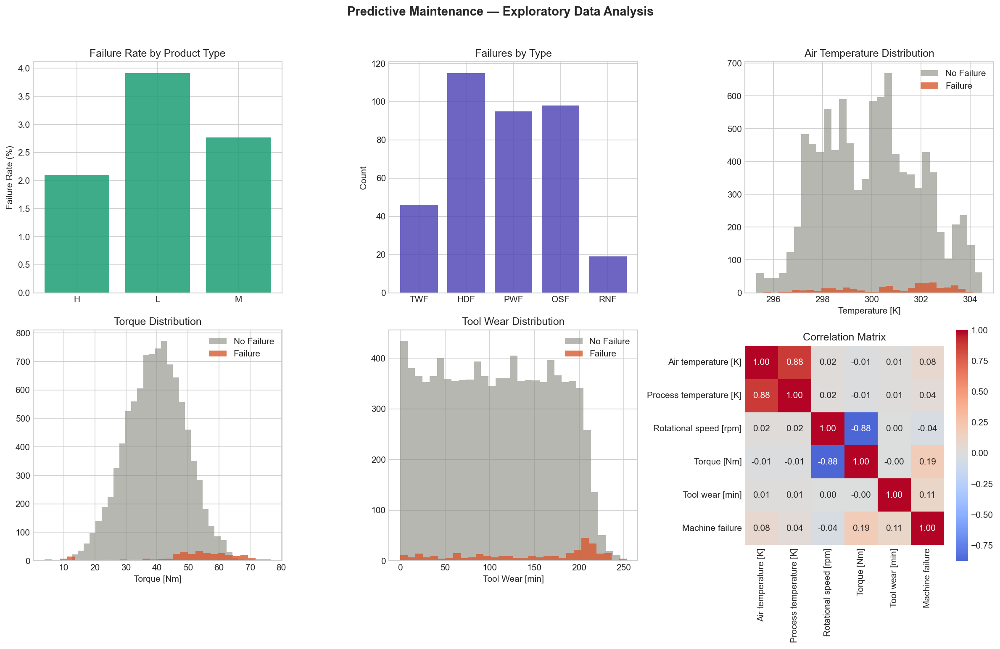

# ⚙️ Predictive Maintenance — Mining Equipment Classification

Machine learning model to predict equipment failure in industrial/mining operations, enabling maintenance teams to act before failures occur and avoid unplanned downtime.

---

## 🎯 Business Objective

Predict whether a machine will fail based on real-time sensor readings — temperature, rotational speed, torque, and tool wear — allowing maintenance teams to schedule interventions proactively instead of reacting to costly breakdowns.

> In mining operations, an unplanned equipment failure can cost thousands of dollars per hour. Detecting 8 out of 10 failures before they happen transforms reactive maintenance into predictive maintenance.

---

## 📊 Model Results

| Model | ROC-AUC | Recall | F1-Score | Precision |
|---|---|---|---|---|
| Random Forest (baseline) | 0.9727 | 0.6765 | 0.7931 | 0.9583 |
| XGBoost (balanced) | **0.9813** | **0.8088** | **0.8148** | **0.8209** |
| XGBoost (GridSearch) | 0.9797 | 0.9412 | 0.5766 | 0.4156 |

> **XGBoost Balanced** is the winning model — best balance between detecting real failures (Recall 80.9%) and minimizing false alarms (Precision 82.1%).

---

## 📈 Visualizations

### Model Evaluation — ROC Curve, Confusion Matrix & Feature Importance


### Exploratory Data Analysis


---

## 🔍 Key Business Findings

1. **Rotational speed and torque are the primary failure drivers** — machines operating outside normal speed/torque ranges show significantly higher failure rates
2. **Tool wear threshold at ~200 minutes** — failures accumulate sharply after 200 minutes of tool wear, defining a clear preventive maintenance interval
3. **HDF (Heat Dissipation Failure) is the most common failure type** — 115 of 339 total failures are heat-related, making temperature monitoring the highest-priority sensor
4. **Low-quality equipment (Type L) fails at 4%** — nearly double the rate of high-quality equipment (Type H: 2.1%), requiring more aggressive maintenance schedules
5. **Engineered features improve prediction** — `power` (torque × angular velocity) and `temp_diff` (process − air temperature), derived from physics domain knowledge, ranked in the top 5 most important features

---

## 🛠️ Feature Engineering

Two physics-based features were created from domain knowledge:

```python
# Power: torque × angular velocity (watts)
df['power'] = df['Torque [Nm]'] * df['Rotational speed [rpm]'] * (2 * π / 60)

# Temperature differential: process vs ambient
df['temp_diff'] = df['Process temperature [K]'] - df['Air temperature [K]']
```

These features ranked 4th and 5th in importance, confirming that domain expertise improves ML model performance beyond raw sensor data.

---

## 📋 Confusion Matrix Interpretation

| | Predicted: No Failure | Predicted: Failure |
|---|---|---|
| **Actual: No Failure** | 1920 ✅ | 12 ⚠️ |
| **Actual: Failure** | 13 ❌ | 55 ✅ |

- **55 failures correctly detected** before they occurred
- **13 failures missed** — undetected breakdowns (minimized by Recall optimization)
- **12 false alarms** — unnecessary preventive checks (low cost vs. real failure)

---

## 🛠️ Technical Stack

- **Python** — pandas, numpy, matplotlib, seaborn
- **Machine Learning** — scikit-learn, XGBoost
- **Techniques** — StratifiedKFold, GridSearchCV, class imbalance handling (scale_pos_weight), feature engineering
- **Metrics** — ROC-AUC, Recall, Precision, F1-Score, Confusion Matrix

---

## 📁 Project Structure

```
predictive-maintenance-mining/
├── predictive_maintenance_classification.ipynb  # Full notebook
├── eda_maintenance.png                          # EDA visualizations
├── model_results_maintenance.png                # Model evaluation charts
└── README.md
```

---

## 📂 Dataset

[AI4I 2020 Predictive Maintenance Dataset](https://archive.ics.uci.edu/dataset/601/ai4i+2020+predictive+maintenance+dataset) — UCI Machine Learning Repository  
10,000 records | 5 failure types | 3.4% failure rate | Synthetic industrial data

---

## 👤 Author

**David Encinas Basurto, PhD**  
[LinkedIn](https://linkedin.com/in/david-encinas) · [GitHub](https://github.com/DavidEncinas)

---

[](TU_LINK_AQUI)

**🚀 [Live Demo — Try the dashboard](https://ymt46jxh9p6z9lhlsvqupy.streamlit.app/)**
